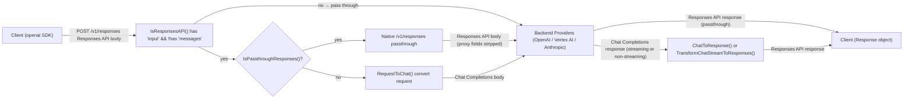

# Responses API

Auto AI Router supports the [OpenAI Responses API](https://platform.openai.com/docs/api-reference/responses) at the `/v1/responses` endpoint. Requests are automatically converted to Chat Completions format internally, so all configured providers (OpenAI, Vertex AI, Anthropic) work transparently.

## How It Works

Detection is automatic: if the request body contains an `input` field and no `messages` field, it is treated as a Responses API request. The proxy then:

1. Converts `input` → `messages` (Chat Completions format)
2. Converts all Responses-specific parameters
3. Forwards to the backend provider
4. Converts the response back to Responses API format

The OpenAI SDK's `client.responses.create()` and `client.responses.stream()` work without any changes.

## Conversion Architecture

### High-Level Flow



### Native Passthrough Models

Some models natively support the `/v1/responses` endpoint and can be forwarded without Chat Completions conversion. The proxy determines whether to use passthrough via `IsPassthroughResponses()`:

- **Auto-detect**: models whose name contains `codex` (e.g. `gpt-5.3-codex`) default to passthrough.
- **Explicit config**: any model can be forced to passthrough or forced to conversion via `passthrough_responses` in the `models` config section.

```yaml
models:
  - model: "gpt-5.3-codex"
    passthrough_responses: true    # explicit (also auto-detected from name)

  - model: "my-responses-model"
    passthrough_responses: true    # non-codex model with native /v1/responses support

  - model: "gpt-4o"
    passthrough_responses: false   # force conversion (default for non-codex)
```

When passthrough is active, the proxy:

1. Strips proxy-only fields (`store`, `metadata`, `ttl`) from the forwarded body.
2. Handles `previous_response_id` from the local store (prepends history to `input`), or keeps it in the body for the provider if not found locally.
3. Normalizes the body for provider compatibility:
   - `input` as a single dict is wrapped into an array (`[dict]`).
   - `instructions` as an array of messages is joined into a single string.
   - Tools in nested Chat Completions format (`{function:{name:...}}`) are flattened to `{name:...}`.
4. Forwards the body to the provider's `/v1/responses` endpoint.
5. Saves the completed response to the local store if `store: true`.

All response store features (`store`, `previous_response_id`, `metadata`, `ttl`, `GET /v1/responses/{id}`) work the same as for converted models.

## Supported Input Formats

### Simple String Input

```python
response = client.responses.create(
    model="gpt-4o",
    input="What is the capital of France?",
)
```

### Array of Messages

```python
response = client.responses.create(
    model="gpt-4o",
    input=[
        {"role": "user", "content": "My favorite number is 42."},
        {"role": "assistant", "content": "That's the answer to everything!"},
        {"role": "user", "content": "What number did I mention?"},
    ],
)
```

Supported roles: `user`, `assistant`, `system`, `developer`.

### Single Message Object

```python
response = client.responses.create(
    model="gpt-4o",
    input={"role": "user", "content": "Hello"},
)
```

### Multipart Content

```python
response = client.responses.create(
    model="gpt-4o",
    input=[
        {
            "role": "user",
            "content": [
                {"type": "input_text", "text": "What color is this image?"},
                {"type": "input_image", "image_url": "https://..."},
            ],
        }
    ],
)
```

Supported content part types:

| Type             | Description                                                          |
| ---------------- | -------------------------------------------------------------------- |
| `input_text`     | Plain text                                                           |
| `input_image`    | Image by URL or data URL (`image_url` field). `detail` is forwarded. |
| `input_audio`    | Audio data (`data` + `format` fields)                                |
| `output_text`    | Assistant text (for passing history)                                 |
| `output_refusal` | Assistant refusal (for passing history)                              |

> **Not supported:** `input_image` with `file_id`, and `input_file`.

## Instructions

The `instructions` field is converted to a `developer`-role message prepended before `input`.

```python
response = client.responses.create(
    model="gpt-4o",
    instructions="You are a helpful math tutor. Be concise.",
    input="What is 5+3?",
)
```

Instructions can also be passed as an array of messages:

```python
response = client.responses.create(
    model="gpt-4o",
    instructions=[
        {"role": "system", "content": "You are a pirate."},
        {"role": "developer", "content": "Reply in one short sentence."},
    ],
    input="Greet me.",
)
```

## Multi-Turn with Tool Calls

Function calls and their outputs can be embedded in the `input` array for multi-turn conversations. Consecutive `function_call` items are merged into a single assistant message with multiple `tool_calls`:

```python
response = client.responses.create(
    model="gpt-4o",
    input=[
        {"role": "user", "content": "What's the weather in Paris?"},
        {
            "type": "function_call",
            "call_id": "call_abc",
            "name": "get_weather",
            "arguments": '{"location": "Paris"}',
        },
        {
            "type": "function_call_output",
            "call_id": "call_abc",
            "output": '{"temperature": 18, "condition": "sunny"}',
        },
    ],
    tools=[...],
)
```

## Tools

Both the flat Responses API format and the nested Chat Completions format are accepted for `function` tools:

```python
# Flat Responses API format (converted to nested Chat Completions internally)
tools = [
    {
        "type": "function",
        "name": "get_weather",
        "description": "Get weather for a location",
        "parameters": {
            "type": "object",
            "properties": {"location": {"type": "string"}},
            "required": ["location"],
        },
        "strict": True,
    }
]
```

### Non-Function Tools

Non-function tool types (`web_search`, `web_search_preview`, `computer_use`, `code_execution`, `google_search_retrieval`, etc.) are passed through the `RequestToChat` conversion as-is. Provider-specific handling applies downstream:

| Tool type                           | OpenAI (Chat Completions)                                                                   | Vertex AI      | Anthropic      |
| ----------------------------------- | ------------------------------------------------------------------------------------------- | -------------- | -------------- |
| `web_search` / `web_search_preview` | Forwarded with `web_search_options` **only for `search-preview` models**; dropped otherwise | Dropped        | Dropped        |
| `computer_use`                      | Dropped                                                                                     | Dropped        | Native support |
| `code_execution`                    | Dropped                                                                                     | Native support | Dropped        |
| `google_search_retrieval`           | Dropped                                                                                     | Native support | Dropped        |

When a non-function tool is not supported by the target provider, it is silently dropped before the request is forwarded.

### Tool Choice

| Value                               | Behavior                               |
| ----------------------------------- | -------------------------------------- |
| `"auto"`                            | Model decides whether to call a tool   |
| `"none"`                            | Model must not call any tool           |
| `"required"`                        | Model must call at least one tool      |
| `{"type": "function", "name": "x"}` | Model must call the specified function |

Non-function `tool_choice` object types (e.g. `{"type": "file_search"}`) are passed through unchanged to the provider. For OpenAI Chat Completions, such values are dropped before forwarding since the endpoint only accepts `"auto"`, `"none"`, `"required"`, or a function reference.

## Parameters Mapping

| Responses API          | Chat Completions              | Notes                                                                                             |
| ---------------------- | ----------------------------- | ------------------------------------------------------------------------------------------------- |
| `input`                | `messages`                    | Converted as described above                                                                      |
| `instructions`         | prepended `developer` message |                                                                                                   |
| `max_output_tokens`    | `max_tokens`                  | Renamed to `max_completion_tokens` for reasoning models (o1/o3/o4/gpt-5) by post-conversion rules |
| `reasoning.effort`     | `reasoning_effort`            | `"low"`, `"medium"`, `"high"`                                                                     |
| `text.format`          | `response_format`             | See below                                                                                         |
| `tools`                | `tools`                       | Flat → nested conversion                                                                          |
| `tool_choice`          | `tool_choice`                 | Object form re-wrapped                                                                            |
| `temperature`          | `temperature`                 | Passed through                                                                                    |
| `top_p`                | `top_p`                       | Passed through                                                                                    |
| `stream`               | `stream`                      | Passed through                                                                                    |
| `store`                | —                             | Handled server-side; see Response Storage                                                         |
| `previous_response_id` | —                             | History prepended before conversion                                                               |
| `metadata`             | —                             | Echoed back in response; not forwarded                                                            |
| `ttl`                  | —                             | Response expiry in seconds (0 = no expiry)                                                        |

### Structured Output (text.format)

```python
response = client.responses.create(
    model="gpt-4o",
    input="List three colors as JSON.",
    text={
        "format": {
            "type": "json_schema",
            "name": "colors",
            "schema": {
                "type": "object",
                "properties": {
                    "colors": {"type": "array", "items": {"type": "string"}}
                },
                "required": ["colors"],
            },
            "strict": True,
        }
    },
)
```

The flat Responses API `json_schema` format is converted to the nested Chat Completions format automatically. `"text"` and `"json_object"` formats pass through unchanged.

## Response Format

The response is a `Response` object with `object: "response"`:

```json
{
  "id": "resp_abc123",
  "object": "response",
  "created_at": 1234567890,
  "model": "gpt-4o",
  "status": "completed",
  "output": [
    {
      "type": "message",
      "id": "msg_abc",
      "status": "completed",
      "role": "assistant",
      "content": [
        {
          "type": "output_text",
          "text": "Paris.",
          "annotations": []
        }
      ]
    }
  ],
  "usage": {
    "input_tokens": 15,
    "output_tokens": 3,
    "total_tokens": 18,
    "input_tokens_details": {"cached_tokens": 0},
    "output_tokens_details": {"reasoning_tokens": 0}
  }
}
```

### Status Values

| Status         | Cause                                     |
| -------------- | ----------------------------------------- |
| `"completed"`  | Normal completion                         |
| `"incomplete"` | Hit `max_output_tokens` or content filter |

When status is `"incomplete"`, `incomplete_details` contains `{"reason": "max_output_tokens"}` or `{"reason": "content_filter"}`.

Tool calls appear as additional output items with `"type": "function_call"`:

```json
{
  "type": "function_call",
  "id": "fc_abc",
  "call_id": "call_xyz",
  "name": "get_weather",
  "arguments": "{\"location\": \"Paris\"}",
  "status": "completed"
}
```

## Streaming

Use `client.responses.stream()` to receive Server-Sent Events in Responses API format.

```python
with client.responses.stream(
    model="gpt-4o",
    input="Count from 1 to 5.",
) as stream:
    for event in stream:
        if isinstance(event, ResponseTextDeltaEvent):
            print(event.delta, end="", flush=True)
        elif isinstance(event, ResponseCompletedEvent):
            print("\nDone. Tokens:", event.response.usage.total_tokens)
```

### SSE Event Sequence

**Text response:**

```
response.created          → initial response object (status: in_progress)
response.in_progress      → same response object
response.output_item.added      (type: message, output_index: 0)
response.content_part.added     (type: output_text, content_index: 0)
response.output_text.delta  ×N  (one per chunk)
response.output_text.done
response.content_part.done
response.output_item.done
response.completed        → full response with usage
```

**Tool call response:**

```
response.created
response.in_progress
response.output_item.added      (type: function_call)
response.function_call_arguments.delta  ×N
response.function_call_arguments.done
response.output_item.done       (type: function_call)
response.completed
```

Usage (`input_tokens`, `output_tokens`, `total_tokens`) is available in the `response.completed` event.

## Response Storage

When `store: true` is set, the completed response is persisted and can later be retrieved or referenced via `previous_response_id`.

```python
response = client.responses.create(
    model="gpt-4o",
    input="What is the capital of France?",
    store=True,
    metadata={"session": "abc123"},
    ttl=3600,  # optional: expire after 1 hour
)
print(response.id)  # e.g. "resp_abc123"
```

Stored responses can be retrieved with `GET /v1/responses/{id}`:

```python
stored = client.get("https://your-proxy/v1/responses/resp_abc123")
```

### Storage Backends

Auto AI Router supports two storage backends selected automatically based on configuration:

| Backend                | When used                       | Key format                                                                |
| ---------------------- | ------------------------------- | ------------------------------------------------------------------------- |
| **bbolt** (local file) | Redis not configured            | `/data/auto_ai_router/responses.db` or `/tmp/auto_ai_router/responses.db` |
| **Redis / Valkey**     | `redis.enabled: true` in config | `{key_prefix}response:{id}` (e.g. `rl:response:resp_abc123`)              |

With the **Redis backend**:

- Responses are shared across all replicas — any pod can retrieve a response stored by another.
- TTL is enforced natively by Redis (`EX` on `SET`); no background cleanup worker is needed.
- Responses with `ttl: 0` persist until Redis evicts them under memory pressure (depends on `maxmemory-policy`).

With the **bbolt backend**:

- Responses are local to the pod that stored them.
- Expired entries are cleaned up by an hourly background worker.
- Location: `/data/auto_ai_router/responses.db` if `/data/auto_ai_router` exists, otherwise `/tmp/auto_ai_router/responses.db`.

See [Redis Integration](./redis.md) for setup instructions.

### Multi-Turn with previous_response_id

Pass `previous_response_id` to continue a conversation from a stored response. The proxy automatically prepends the full history (accumulated input + previous output) before forwarding to the provider:

```python
response2 = client.responses.create(
    model="gpt-4o",
    input="And what is the population of that city?",
    previous_response_id=response.id,
    store=True,
)
```

The previous response must have been stored with `store=True` and must belong to the same API key (or be accessed via master key).

## Field Handling Reference

### Forwarded to Provider (pass-through)

These fields survive conversion and are sent to the backend as-is in the Chat Completions body:

| Field                  | Notes                                                     |
| ---------------------- | --------------------------------------------------------- |
| `temperature`, `top_p` | Standard Chat Completions params                          |
| `user`                 | Forwarded; providers that support it (OpenAI) will use it |
| `parallel_tool_calls`  | Valid Chat Completions param, forwarded as-is             |

### Handled Server-Side (not forwarded to provider)

These fields are consumed by the proxy before the request reaches the provider:

| Field                  | Behavior                                                       |
| ---------------------- | -------------------------------------------------------------- |
| `store`                | `true` → response saved to bbolt store after completion        |
| `previous_response_id` | History prepended to `input` from the stored previous response |
| `metadata`             | Stored alongside response; echoed back in the Response object  |
| `ttl`                  | Response expiry in seconds; 0 = no expiry                      |

### Deleted Before Forwarding (not yet implemented)

These fields are stripped in `deleteResponsesFields()` before the request reaches the provider:

| Field               | Reason not forwarded                                       |
| ------------------- | ---------------------------------------------------------- |
| `conversation`      | Requires server-side conversation management               |
| `include`           | Each includable needs separate implementation              |
| `stream_options`    | We inject our own `include_usage:true`; user settings lost |
| `truncation`        | Context truncation not yet implemented                     |
| `service_tier`      | Not mapped to credential selection yet                     |
| `safety_identifier` | No provider-agnostic mapping                               |
