# Responses API

Auto AI Router supports the [OpenAI Responses API](https://platform.openai.com/docs/api-reference/responses) at the `/v1/responses` endpoint. Requests are automatically converted to Chat Completions format internally, so all configured providers (OpenAI, Vertex AI, Anthropic) work transparently.

## How It Works

Detection is automatic: if the request body contains an `input` field and no `messages` field, it is treated as a Responses API request. The proxy then:

1. Converts `input` → `messages` (Chat Completions format)
2. Converts all Responses-specific parameters
3. Forwards to the backend provider
4. Converts the response back to Responses API format

The OpenAI SDK's `client.responses.create()` and `client.responses.stream()` work without any changes.

## Conversion Architecture

### High-Level Flow

```mermaid
flowchart LR
    Client["Client (openai SDK)"]
    Detect["IsResponsesAPI() has 'input' && !has 'messages'"]
    ConvReq["RequestToChat() convert request"]
    Providers["Backend Providers (OpenAI / Vertex AI / Anthropic)"]
    ConvResp["ChatToResponse() or TransformChatStreamToResponses()"]
    Client2["Client (Response object)"]

    Client -->|"POST /v1/responses Responses API body"| Detect
    Detect -->|"yes"| ConvReq
    Detect -->|"no → pass through"| Providers
    ConvReq -->|"Chat Completions body"| Providers
    Providers -->|"Chat Completions response (streaming or non-streaming)"| ConvResp
    ConvResp -->|"Responses API response"| Client2
```



## Supported Input Formats

### Simple String Input

```python
response = client.responses.create(
    model="gpt-4o",
    input="What is the capital of France?",
)
```

### Array of Messages

```python
response = client.responses.create(
    model="gpt-4o",
    input=[
        {"role": "user", "content": "My favorite number is 42."},
        {"role": "assistant", "content": "That's the answer to everything!"},
        {"role": "user", "content": "What number did I mention?"},
    ],
)
```

Supported roles: `user`, `assistant`, `system`, `developer`.

### Single Message Object

```python
response = client.responses.create(
    model="gpt-4o",
    input={"role": "user", "content": "Hello"},
)
```

### Multipart Content

```python
response = client.responses.create(
    model="gpt-4o",
    input=[{
        "role": "user",
        "content": [
            {"type": "input_text", "text": "What color is this image?"},
            {"type": "input_image", "image_url": "https://..."},
        ],
    }],
)
```

Supported content part types:

| Type | Description |
|------|-------------|
| `input_text` | Plain text |
| `input_image` | Image by URL or data URL (`image_url` field). `detail` is forwarded. |
| `input_audio` | Audio data (`data` + `format` fields) |
| `output_text` | Assistant text (for passing history) |
| `output_refusal` | Assistant refusal (for passing history) |

> **Not supported:** `input_image` with `file_id`, and `input_file`.

## Instructions

The `instructions` field is converted to a `developer`-role message prepended before `input`.

```python
response = client.responses.create(
    model="gpt-4o",
    instructions="You are a helpful math tutor. Be concise.",
    input="What is 5+3?",
)
```

Instructions can also be passed as an array of messages:

```python
response = client.responses.create(
    model="gpt-4o",
    instructions=[
        {"role": "system", "content": "You are a pirate."},
        {"role": "developer", "content": "Reply in one short sentence."},
    ],
    input="Greet me.",
)
```

## Multi-Turn with Tool Calls

Function calls and their outputs can be embedded in the `input` array for multi-turn conversations. Consecutive `function_call` items are merged into a single assistant message with multiple `tool_calls`:

```python
response = client.responses.create(
    model="gpt-4o",
    input=[
        {"role": "user", "content": "What's the weather in Paris?"},
        {
            "type": "function_call",
            "call_id": "call_abc",
            "name": "get_weather",
            "arguments": '{"location": "Paris"}',
        },
        {
            "type": "function_call_output",
            "call_id": "call_abc",
            "output": '{"temperature": 18, "condition": "sunny"}',
        },
    ],
    tools=[...],
)
```

## Tools

Only `function` type tools are supported. Both the flat Responses API format and the nested Chat Completions format are accepted:

```python
# Flat Responses API format
tools = [{
    "type": "function",
    "name": "get_weather",
    "description": "Get weather for a location",
    "parameters": {
        "type": "object",
        "properties": {"location": {"type": "string"}},
        "required": ["location"],
    },
    "strict": True,
}]
```

### Tool Choice

| Value | Behavior |
|-------|----------|
| `"auto"` | Model decides whether to call a tool |
| `"none"` | Model must not call any tool |
| `"required"` | Model must call at least one tool |
| `{"type": "function", "name": "x"}` | Model must call the specified function |

> Other `tool_choice` object types (e.g. `file_search`) are rejected with an error.

## Parameters Mapping

| Responses API | Chat Completions | Notes |
|---------------|-----------------|-------|
| `input` | `messages` | Converted as described above |
| `instructions` | prepended `developer` message | |
| `max_output_tokens` | `max_completion_tokens` | |
| `reasoning.effort` | `reasoning_effort` | `"low"`, `"medium"`, `"high"` |
| `text.format` | `response_format` | See below |
| `tools` | `tools` | Flat → nested conversion |
| `tool_choice` | `tool_choice` | Object form re-wrapped |
| `temperature` | `temperature` | Passed through |
| `top_p` | `top_p` | Passed through |
| `stream` | `stream` | Passed through |

### Structured Output (text.format)

```python
response = client.responses.create(
    model="gpt-4o",
    input="List three colors as JSON.",
    text={"format": {
        "type": "json_schema",
        "name": "colors",
        "schema": {
            "type": "object",
            "properties": {"colors": {"type": "array", "items": {"type": "string"}}},
            "required": ["colors"],
        },
        "strict": True,
    }},
)
```

The flat Responses API `json_schema` format is converted to the nested Chat Completions format automatically. `"text"` and `"json_object"` formats pass through unchanged.

## Response Format

The response is a `Response` object with `object: "response"`:

```json
{
  "id": "resp_abc123",
  "object": "response",
  "created_at": 1234567890,
  "model": "gpt-4o",
  "status": "completed",
  "output": [
    {
      "type": "message",
      "id": "msg_abc",
      "status": "completed",
      "role": "assistant",
      "content": [
        {
          "type": "output_text",
          "text": "Paris.",
          "annotations": []
        }
      ]
    }
  ],
  "usage": {
    "input_tokens": 15,
    "output_tokens": 3,
    "total_tokens": 18,
    "input_tokens_details": {"cached_tokens": 0},
    "output_tokens_details": {"reasoning_tokens": 0}
  }
}
```

### Status Values

| Status | Cause |
|--------|-------|
| `"completed"` | Normal completion |
| `"incomplete"` | Hit `max_output_tokens` or content filter |

When status is `"incomplete"`, `incomplete_details` contains `{"reason": "max_output_tokens"}` or `{"reason": "content_filter"}`.

Tool calls appear as additional output items with `"type": "function_call"`:

```json
{
  "type": "function_call",
  "id": "fc_abc",
  "call_id": "call_xyz",
  "name": "get_weather",
  "arguments": "{\"location\": \"Paris\"}",
  "status": "completed"
}
```

## Streaming

Use `client.responses.stream()` to receive Server-Sent Events in Responses API format.

```python
with client.responses.stream(
    model="gpt-4o",
    input="Count from 1 to 5.",
) as stream:
    for event in stream:
        if isinstance(event, ResponseTextDeltaEvent):
            print(event.delta, end="", flush=True)
        elif isinstance(event, ResponseCompletedEvent):
            print("\nDone. Tokens:", event.response.usage.total_tokens)
```

### SSE Event Sequence

**Text response:**
```
response.created          → initial response object (status: in_progress)
response.in_progress      → same response object
response.output_item.added      (type: message, output_index: 0)
response.content_part.added     (type: output_text, content_index: 0)
response.output_text.delta  ×N  (one per chunk)
response.output_text.done
response.content_part.done
response.output_item.done
response.completed        → full response with usage
```

**Tool call response:**
```
response.created
response.in_progress
response.output_item.added      (type: function_call)
response.function_call_arguments.delta  ×N
response.function_call_arguments.done
response.output_item.done       (type: function_call)
response.completed
```

Usage (`input_tokens`, `output_tokens`, `total_tokens`) is available in the `response.completed` event.

## Ignored / Pass-Through Fields

The following Responses API fields are accepted without error but are not processed:

- `store`, `previous_response_id` — stateless proxy, no server-side state
- `conversation` — use `input` array for conversation history instead
- `include` — additional output inclusions not supported
- `truncation`, `safety_identifier`, `service_tier`, `stream_options`
- `metadata`, `user`, `parallel_tool_calls`
