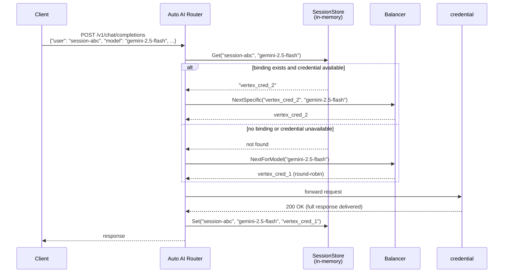
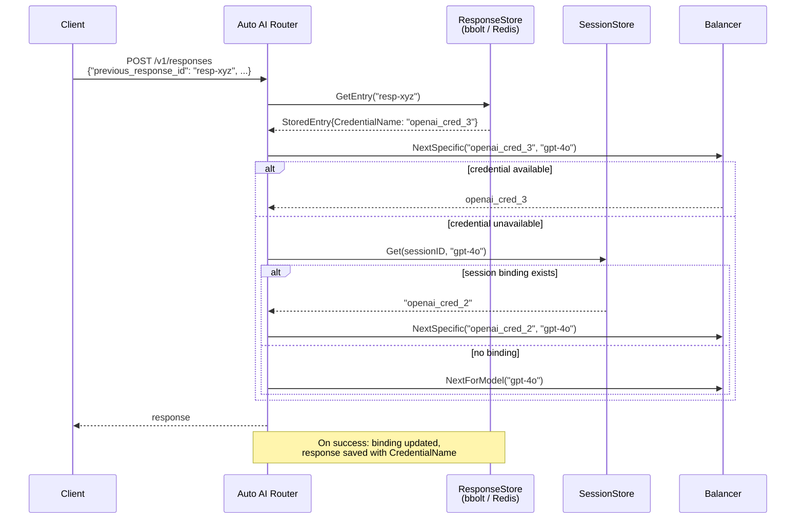
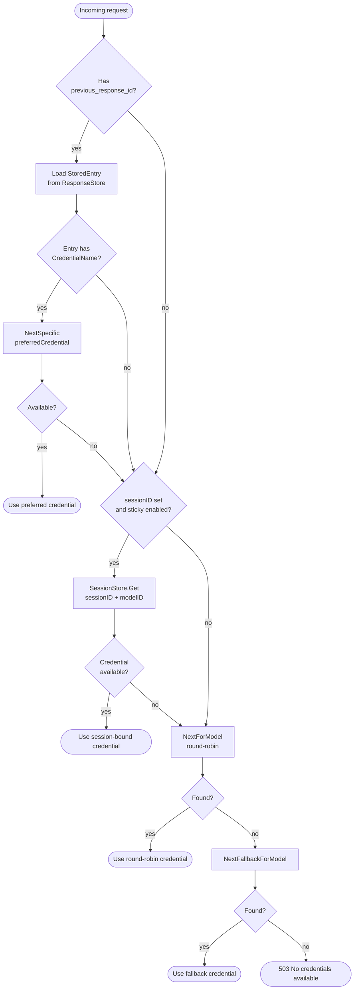
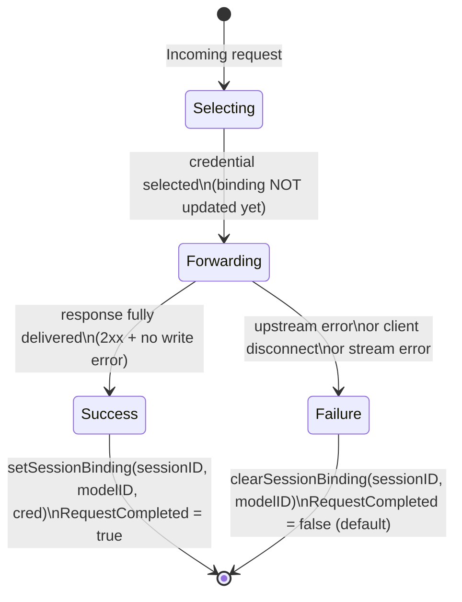

# Session-Sticky Credential Routing

Session-sticky routing ensures that requests belonging to the same conversation or session are routed to the **same backend credential** on every turn. This maximises the chance of hitting the provider's prompt cache and reduces redundant token processing costs.

## Why It Matters

Modern LLM providers maintain an internal prompt cache. When consecutive turns of a conversation reach the same model instance behind the same API key, the provider can reuse the cached KV-state of the prefix and charge only for new tokens:

| Scenario               | Without sticky routing | With sticky routing           |
| ---------------------- | ---------------------- | ----------------------------- |
| Turn 1 (10 000 tokens) | cred_A, full cost      | cred_A, full cost             |
| Turn 2 (10 200 tokens) | cred_B, full cost      | cred_A, 200 new tokens billed |
| Turn 3 (10 400 tokens) | cred_A, full cost      | cred_A, 200 new tokens billed |

The savings scale with context length. For long conversations the effective cost can drop by 80–90 %.

Sticky routing also helps providers that require continuity for features like:

- Vertex AI `thoughtSignature` (reasoning continuation)
- Anthropic extended thinking across turns

## How It Works

### Session-Sticky Routing



### Responses API Sticky Routing (via `previous_response_id`)

When using the Responses API with `previous_response_id`, the proxy additionally remembers which credential served each stored response. This gives an even stronger affinity guarantee:



### Credential Selection Priority



### Binding Lifecycle

The binding is **only written on full success** — after the entire response has been delivered to the client without error. This prevents a failed request from locking future traffic to a bad credential.



Key consequences:

- A binding points to a credential that **successfully completed at least one request** and is therefore likely to have a warm cache.
- If a credential gets banned or rate-limited between turns, the sticky lookup fails gracefully and the proxy falls back to normal selection — no request is dropped.
- On same-type retry or fallback proxy success, the binding is updated to the **winning** credential, not the original one.

## Sources of Session ID

The proxy extracts a session ID from the request body in the following priority order:

| Field                           | Location                          |
| ------------------------------- | --------------------------------- |
| `extra_body.litellm_session_id` | nested in `extra_body`            |
| `extra_body.chat_id`            | nested in `extra_body`            |
| `extra_body.session_id`         | nested in `extra_body`            |
| `session_id`                    | top-level field                   |
| `user`                          | top-level field (OpenAI standard) |
| `safety_identifier`             | top-level field                   |
| `prompt_cache_key`              | top-level field                   |

The simplest approach — compatible with the standard OpenAI SDK — is to pass `user`:

```python
response = client.chat.completions.create(
    model="gemini-2.5-flash",
    messages=[...],
    user="conversation-id-or-user-id",
)
```

For multipart requests the proxy reads `session_id` or `user` from the form fields.

## Configuration

### Enable / Disable

Session-sticky routing is **enabled by default**. To disable it:

```yaml
server:
  session_sticky_enabled: false
```

When disabled, no `SessionStore` is created and all routing uses plain round-robin. Behaviour is identical to versions before the feature was introduced.

### TTL

The binding expires after the configured TTL of inactivity. After expiry, the next request starts a new binding via round-robin.

```yaml
server:
  session_sticky_ttl_minutes: 6   # default: 6 minutes
```

Choose a TTL that matches your conversation cadence:

| Use case                      | Recommended TTL                       |
| ----------------------------- | ------------------------------------- |
| Interactive chat (fast turns) | 5–10 minutes (default)                |
| Agentic / slow workflows      | 30–60 minutes                         |
| Batch processing with breaks  | disable sticky or use a very long TTL |

Negative values are rejected at startup.

### Automatic Anthropic Prompt Caching

When routing to an **Anthropic** or **Bedrock** credential with an active session, the proxy automatically injects `cache_control: {type: "ephemeral"}` markers into the request body. This converts automatic same-credential affinity into explicit provider-level prompt caching, reducing token costs by up to 90% on long conversations.

**Enabled by default.** To disable:

```yaml
server:
  session_sticky_auto_cache_control: false
```

#### What gets marked

The proxy follows Anthropic's recommended multi-turn caching pattern:

| Position         | What is marked                                            |
| ---------------- | --------------------------------------------------------- |
| System message   | Last content block (stable across all turns)              |
| History boundary | Last content block of the **second-to-last** user message |

```
system: [large context] ← cache_control: ephemeral
user:   turn 1          ← cache_control: ephemeral (history boundary)
asst:   turn 1
user:   current message   (not marked — changes every turn)
```

The current user message is intentionally left unmarked because it changes with every request. Marking the boundary of stable history is sufficient for Anthropic to cache the expensive prefix.

#### Interaction with manual cache_control

If the incoming request **already contains** any `cache_control` field anywhere in its content blocks, auto-injection is skipped entirely. Manual markers always take precedence.

#### Trigger conditions

Auto-injection fires when **all** of the following are true:

- `session_sticky_auto_cache_control: true` (default)
- Credential type is `anthropic` or `bedrock`
- A session is active: request has a session ID **or** `previous_response_id` resolved to a known credential

### Full Example

```yaml
server:
  port: 8080
  master_key: "os.environ/MASTER_KEY"
  session_sticky_enabled: true
  session_sticky_ttl_minutes: 10
  session_sticky_auto_cache_control: true   # default — explicit for clarity

credentials:
  - name: "vertex_cred_1"
    type: "vertex-ai"
    credentials_file: "os.environ/VERTEX_KEY_1"
    rpm: 60

  - name: "vertex_cred_2"
    type: "vertex-ai"
    credentials_file: "os.environ/VERTEX_KEY_2"
    rpm: 60

  - name: "vertex_cred_3"
    type: "vertex-ai"
    credentials_file: "os.environ/VERTEX_KEY_3"
    rpm: 60
```

With this config, three Vertex AI credentials share the load in round-robin. Once a session is established on `vertex_cred_2`, all subsequent turns of that conversation go to `vertex_cred_2` (as long as it is available and the TTL has not expired). A new session starts fresh via round-robin.

## Interaction with Responses API

If you use the Responses API (`POST /v1/responses`) with `store: true`, the proxy persists the `CredentialName` alongside the stored response. On the next turn, `previous_response_id` is resolved to that credential before session-sticky or round-robin selection is attempted.

This gives you two independent layers of cache affinity:

1. **Responses API sticky** — direct link to the credential that created the previous response.
2. **Session-sticky** — fallback if the response-level credential is unavailable.

```python
# Turn 1 — no previous_response_id, round-robin selects a credential
r1 = client.responses.create(
    model="gpt-4o",
    input="Hello!",
    store=True,
    user="conv-123",
)

# Turn 2 — proxy prefers the credential from r1 (Responses API sticky)
# then falls back to session-sticky (user="conv-123"), then round-robin
r2 = client.responses.create(
    model="gpt-4o",
    input="Continue our conversation.",
    previous_response_id=r1.id,
    store=True,
    user="conv-123",
)
```

## Edge Cases

| Scenario                             | Behaviour                                                                               |
| ------------------------------------ | --------------------------------------------------------------------------------------- |
| `session_sticky_enabled: false`      | Plain round-robin, no binding stored                                                    |
| No `user` / `session_id` in request  | No binding attempted, plain round-robin                                                 |
| First request for a session          | Round-robin selects credential; binding written only on success                         |
| Bound credential is banned           | Graceful fallback to round-robin; binding is NOT cleared (still valid for other models) |
| Bound credential is rate-limited     | Same as banned — fallback, binding kept                                                 |
| Bound credential removed from config | `NextSpecific` returns not-found; fallback to round-robin                               |
| Request fails (5xx / disconnect)     | Binding is cleared by `defer` in `ProxyRequest`                                         |
| Streaming failure mid-stream         | `streamCompleted = false` → binding cleared                                             |
| Same-type retry succeeds on cred B   | Binding updated to cred B                                                               |
| Fallback proxy succeeds              | Binding updated to fallback credential                                                  |
| TTL expired between turns            | Binding treated as absent; next round-robin result starts a new binding                 |
| One `sessionID`, multiple models     | Independent bindings per `{sessionID, modelID}` pair                                    |

## Performance Notes

- `SessionStore` is an in-memory `sync.RWMutex`-protected map — lookup is O(1) and sub-microsecond.
- `NextSpecific` acquires a **read lock** on the balancer — it does not block concurrent round-robin selections.
- The background cleanup goroutine runs every 2 minutes and removes expired entries.
- At very high session counts (millions of concurrent sessions) consider using a Redis-backed store for the `ResponseStore` and monitoring memory usage of `SessionStore`.
