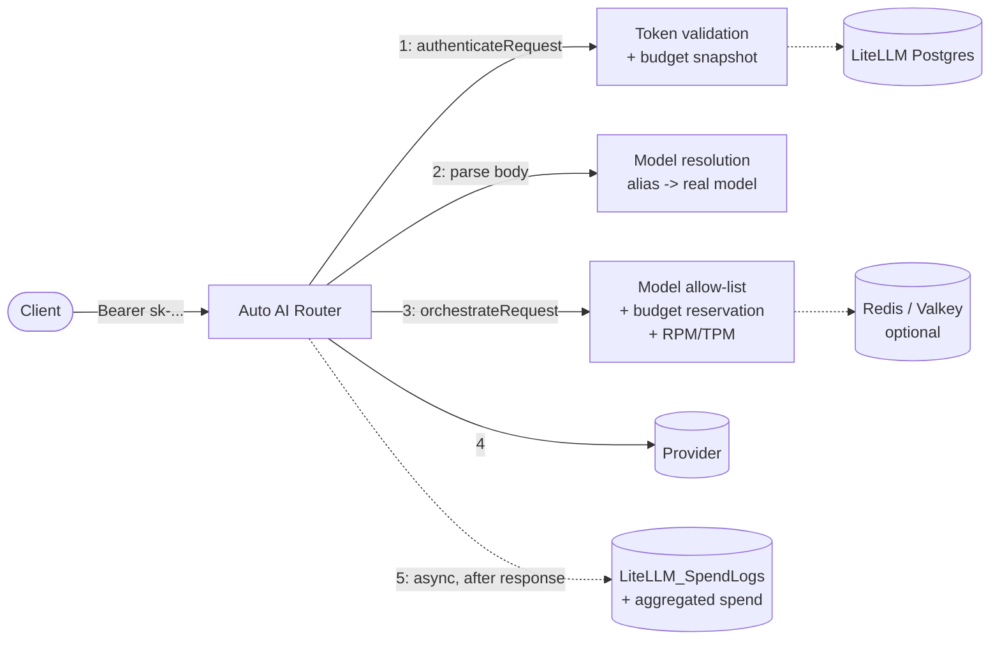
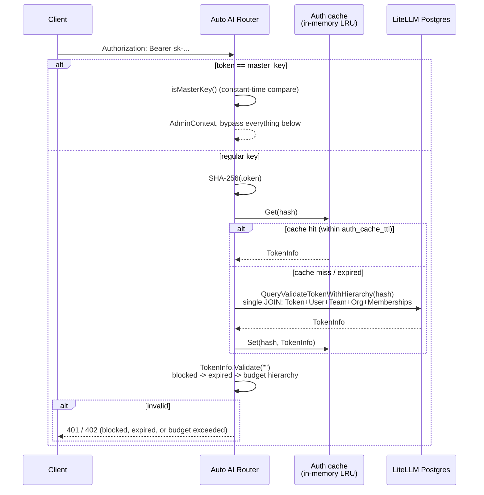
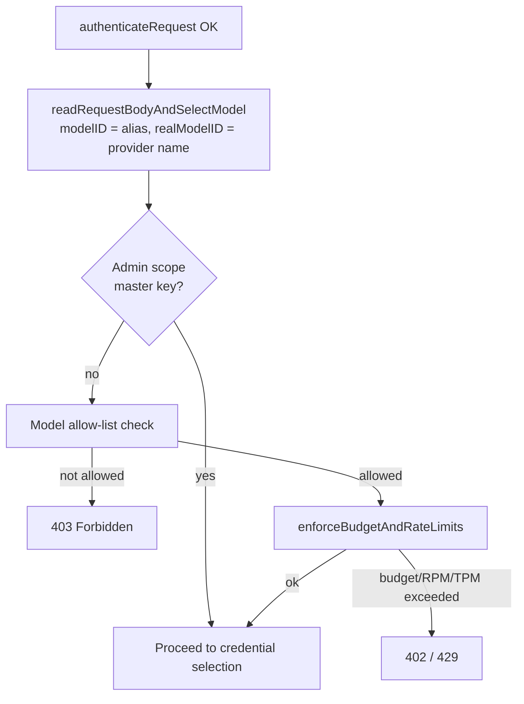
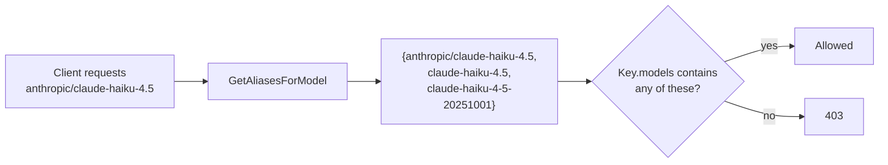
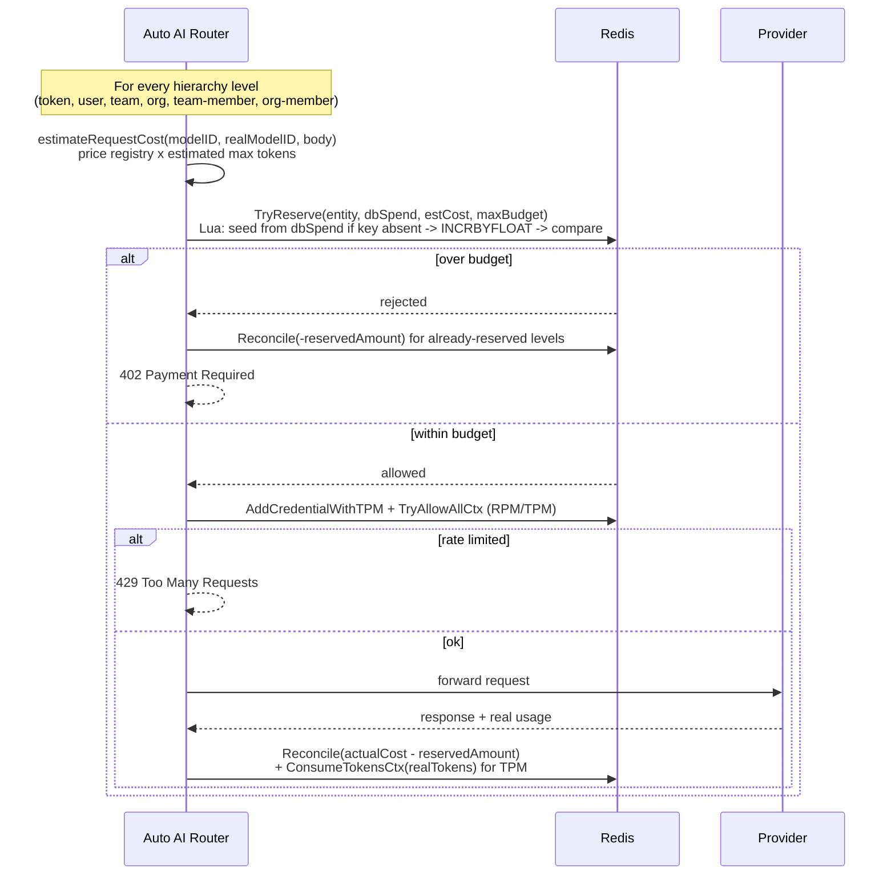
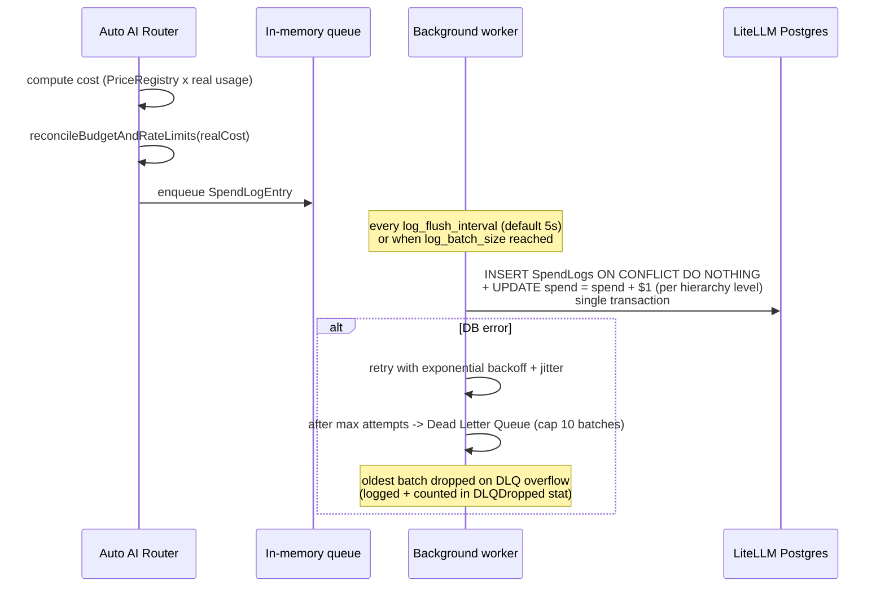
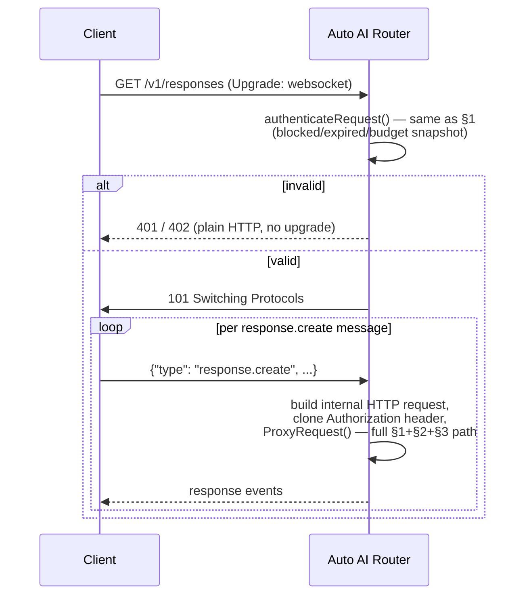

# LiteLLM Auth & Billing Flow

How Auto AI Router authenticates a request against a LiteLLM Postgres database, enforces budgets/rate limits/model access, and logs spend afterwards. See [litellm_db.md](litellm_db.md) for connection/config basics and [kafka_spend_log.md](kafka_spend_log.md) for the analytics write-path.

## Overview



Everything below runs only when `litellm_db.enabled: true`. With it disabled, Auto AI Router falls back to YAML-only credentials with no per-key auth or billing.

## 1. Token validation (`authenticateRequest`)

`internal/proxy/orchestrator.go` → `authenticateRequest()` runs first, before the request body is even read.



- The hash (never the raw key) is what's stored in Postgres and used as the cache key.
- `Validate()` checks, in order: `Blocked` → `Expires` → token budget → team → team-member → org → user → org-member budget (embedded budgets compare `Spend > MaxBudget`; org uses `LiteLLM_BudgetTable`).
- The model isn't known yet at this point (`Validate("")` — model check is skipped), so the pre-check here is deliberately budget/expiry-only.
- Cache invalidation is TTL-only (`auth_cache_ttl`, default 5s). There is no push invalidation from LiteLLM admin actions (`InvalidateToken`/`InvalidateAll` exist but nothing calls them yet) — a blocked/rebudgeted key can stay valid in a hot cache for up to `auth_cache_ttl`.
- The cache is per-instance, not shared across replicas.

## 2. Model resolution + allow-list + budget/rate-limit enforcement (`orchestrateRequest`)

Once auth succeeds, the body is parsed and the model alias resolved to its real provider-facing name, then three checks run in order.



### 2a. Model allow-list

`TokenInfo.IsAnyModelAllowed()` (`internal/litellmdb/models/models.go`) resolves LiteLLM's sentinel values before checking membership:

- `all-proxy-models` in `VerificationToken.models` → any model allowed.
- `all-team-models` → inherits the parent team's `LiteLLM_TeamTable.models` list (no team → unrestricted).
- Empty list → unrestricted (LiteLLM's own default).

**Alias equivalence.** The same provider model is often exposed under several route aliases in `config.yaml` (e.g. `claude-haiku-4.5` and `anthropic/claude-haiku-4.5` both resolving to `claude-haiku-4-5-20251001` on the same credential — see `config.yaml.example`). A key restricted to one such alias is meant to allow the underlying model, not that one spelling. `orchestrateRequest` therefore calls `modelManager.GetAliasesForModel(modelID, realModelID)` to build the full alias group for the requested model (across every credential that serves it) and checks the key's allow-list against *any* of them, not just the literal string the client sent.



### 2b. Budget reservation + RPM/TPM (`enforceBudgetAndRateLimits`)

Opt-in, Redis-backed, closes the pre-check-vs-actual-spend race that the DB-snapshot check in §1 leaves open (a burst of concurrent requests can all pass the snapshot check before any of their spend is written back). No-op when either flag is off or Redis is disabled — the DB-snapshot check from `Validate()` remains the only protection in that case.



Key properties:

- **Seed-once-per-TTL**: the Redis counter is only seeded from the authoritative DB `spend` value when the key doesn't already exist; after that it's purely Redis-side until the TTL (`budget_reservation_ttl`, default 15m) expires and it reseeds. This bounds staleness after an out-of-band DB change (e.g. an admin resetting budget).
- **Reconcile exactly once**: guarded by `RequestLogContext.budgetReconciled`. The real call site is `logSpendToLiteLLMDB` (after the true cost is computed); a `defer` in `ProxyRequest` calls it a second time with cost `0` as a safety net for paths that never reach a credential (early failures) — the guard makes that a no-op once real reconciliation already happened.
- **Fail open on Redis errors**: a `TryReserve` error logs a warning and allows the request — the DB-snapshot check remains the backstop.
- **RPM/TPM** uses a second `ratelimit.RPMLimiter` instance (namespace `litellmauth:`, separate from the per-credential/provider limiter) keyed by `token:<hash>`, `user:<id>`, `team:<id>`, `org:<id>`, `teammember:<team>:<user>`, `orgmember:<org>:<user>`.

## 3. Spend logging (post-call, async)

Doesn't block the client response.



Row-lock ordering: `updateTokens`/`updateUsers`/`updateTeams`/`updateOrgs`/`updateTeamMembers`/`updateOrgMembers` iterate map keys in sorted order (`sortedKeys()`) so that two concurrent batches touching overlapping rows always take their `UPDATE` locks in the same order — avoids Postgres deadlocks (`40P01`) that unordered map iteration would otherwise risk.

## 4. WebSocket (`/v1/responses`, upgrade)

Authentication happens **before** the WebSocket upgrade, not after:



The per-message path re-runs the entire auth+billing flow (model allow-list, budget reservation, spend logging) exactly as the plain HTTP endpoints do — the pre-upgrade check only gates connection establishment so an unauthenticated client can't hold an open socket for free.

## 5. `/v1/responses/{id}` (GET, stored response retrieval)

Lighter-weight than the LLM-call endpoints, but still validates the token when LiteLLM DB is enabled: non-master-key requests call `ValidateToken()` (blocked/expired/budget — same as §1) before the ownership check (`apiKeyHash` must match the response's owner). If the DB is unavailable, this degrades to ownership-only so reads stay available during an outage.

## Configuration

```yaml
litellm_db:
  enabled: true
  auth_cache_ttl: 20s                        # staleness window for blocked/budget/model changes
  auth_cache_size: 10000
  enforce_budget_reservation: false          # opt-in: Redis atomic budget reservation (§2b)
  enforce_key_rate_limits: false             # opt-in: Redis per-key/user/team/org RPM/TPM (§2b)
  budget_reservation_ttl: 15m                # Redis counter TTL / reseed-from-DB interval
  default_estimated_completion_tokens: 1000  # used when a request has no max_tokens

redis:
  enabled: true   # required for enforce_budget_reservation / enforce_key_rate_limits to take effect
  addresses:
    - "os.environ/REDIS_ADDRESS"
```

| Parameter                             | Type     | Default | Description                                                                                |
| ------------------------------------- | -------- | ------- | ------------------------------------------------------------------------------------------ |
| `auth_cache_ttl`                      | duration | 5s      | How long a validated token is trusted from the in-memory cache before re-querying Postgres |
| `auth_cache_size`                     | int      | 10000   | Max entries in the auth LRU cache                                                          |
| `enforce_budget_reservation`          | bool     | false   | Atomic Redis budget pre-reservation (§2b). No-op if `redis.enabled: false`                 |
| `enforce_key_rate_limits`             | bool     | false   | Atomic Redis RPM/TPM per key/user/team/org (§2b). No-op if `redis.enabled: false`          |
| `budget_reservation_ttl`              | duration | 15m     | TTL of a Redis budget counter before it reseeds from DB `spend`                            |
| `default_estimated_completion_tokens` | int      | 1000    | Completion-token estimate for budget reservation when `max_tokens` is absent               |

Both `enforce_*` flags default to `false`: enabling them changes production enforcement behavior (requests can start failing with 402/429 that previously passed), so it's an explicit opt-in. The model allow-list check (§2a) has no such flag — it is always enforced for non-admin keys once `litellm_db.enabled: true`.

## Known limitations

- **Cache invalidation is TTL-only.** Blocking a key or lowering its budget in the LiteLLM admin panel takes up to `auth_cache_ttl` to take effect on a given replica (up to 15m for the *spend counter itself* if it's already tracked in Redis — see `budget_reservation_ttl`).
- **Streaming reconciliation on error paths.** If a streaming request fails after the provider already produced billable tokens but before the response reaches `logSpendToLiteLLMDB`, the `defer` safety net reconciles the Redis reservation at cost `0` (releases the full reservation). This can't cause overspend (it only makes the Redis counter *more* permissive than reality), but it can let the Redis counter drift below the true DB spend until the next TTL-driven reseed.
- **No compensating logic for aborted streams** when `drain_upstream_on_abort: false` — cost is billed on estimated/partial usage, with no later reconciliation against the provider's own usage records.
