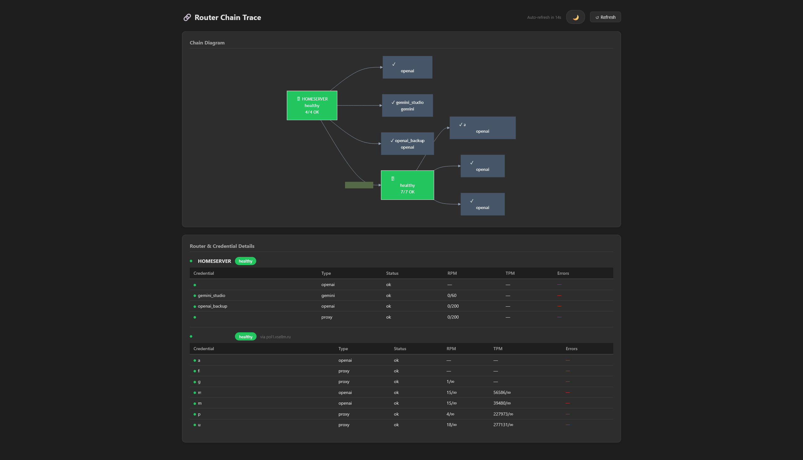

# Router Chain Trace

## JSON Trace — `/trace`

Returns a recursive snapshot of the full router chain in JSON format:

```bash
curl http://localhost:8080/trace
```

Each node in the response contains:

- `router_id` — identifier of the router (hostname by default)
- `status` — `healthy`, `degraded`, or `unhealthy`
- `credentials` — per-credential stats (type, RPM/TPM usage, ban status, error counts)
- `models` — per-model stats
- `upstreams` — nested trace responses for each connected proxy credential

### Depth parameter

By default the trace follows up to 25 hops. Use `?depth=N` (0–10) to limit recursion:

```bash
# Local router only
curl "http://localhost:8080/trace?depth=0"

# Two hops deep
curl "http://localhost:8080/trace?depth=2"
```

### Response shape

```json
{
  "router_id": "my-router",
  "status": "healthy",
  "credentials": {
    "vertex-prod": {
      "type": "vertex-ai",
      "is_banned": false,
      "current_rpm": 12,
      "limit_rpm": 600,
      "current_tpm": 5000,
      "limit_tpm": 100000
    }
  },
  "models": { ... },
  "upstreams": {
    "proxy-eu": {
      "router_id": "eu-router",
      "status": "healthy",
      ...
    }
  }
}
```

### Fallback for legacy routers

If an upstream proxy does not yet expose `/trace` (older deployment), the router automatically falls back to fetching its `/health` endpoint and includes that data in the chain. The `upstreams` field will be absent for such nodes since depth cannot be traversed further.

## HTML Dashboard — `/vtrace`

An interactive dashboard showing the router chain as a readable route diagram with per-credential tables:

```
http://localhost:8080/vtrace
```



Features:

- Route diagram grouped into primary and fallback route lanes
- Legacy chain diagram below the route diagram for full topology debugging, with vector zoom up to 2000%
- Router focus tabs and proxy cards to drill into a downstream proxy node without rendering the whole tree
- Provider-family filters inferred from model names, for example Anthropic, OpenAI, Google, ZAI, Qwen, or proxy
- Model text filter for narrowing a route view to one model family or concrete model name
- Primary/fallback route lanes showing provider URLs and when traffic moves to fallback on 429, 5xx, ban, or limit pressure
- Per-router credential tables with source type, primary/fallback role, model-provider family, RPM/TPM usage, ban status, and error codes
- Auto-refresh every 30 seconds
- Dark / light theme toggle with preference saved in `localStorage`

## Notes

- Trace endpoints do not require authentication
- The depth parameter is capped at 10 to prevent runaway recursion
- A 15-second request timeout is applied to the full chain traversal
- Upstream fetches are rate-limited to one request per 100 ms per credential
